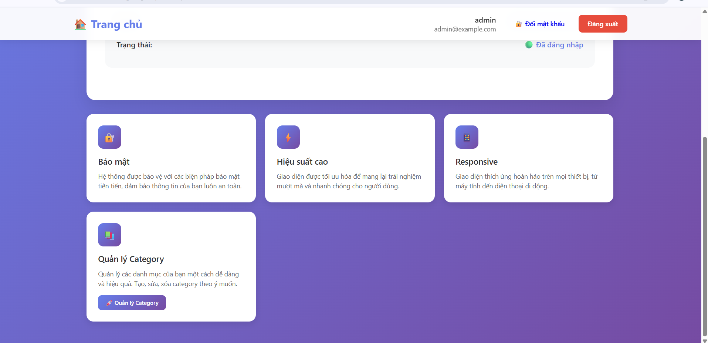
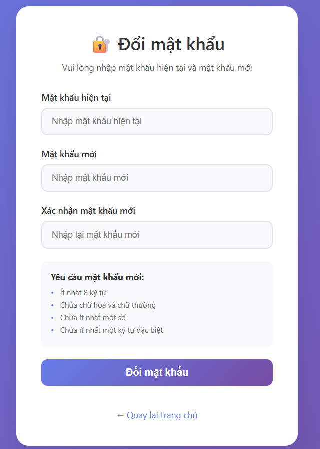
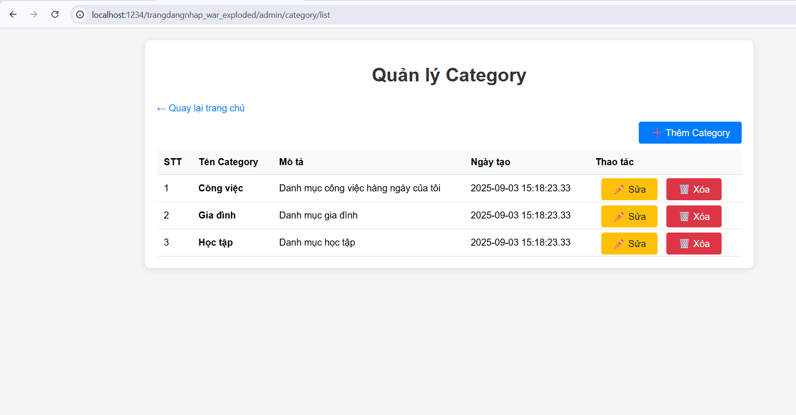
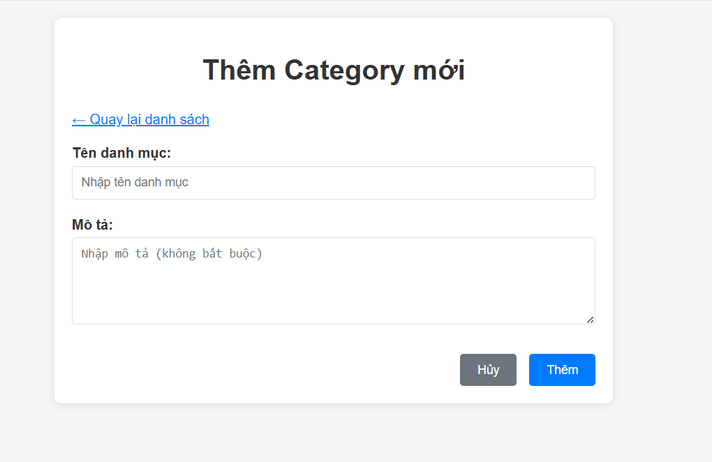

# 🚀 Hệ thống Quản lý Đăng nhập/Đăng ký

[](https://openjdk.org/)
[](https://maven.apache.org/)
[](https://jakarta.ee/specifications/servlet/)
[](https://jakarta.ee/specifications/pages/)
[](https://www.microsoft.com/en-us/sql-server/)

> Một hệ thống quản lý đăng nhập/đăng ký hiện đại được xây dựng bằng Java Servlet, JSP và SQL Server với giao diện người dùng đẹp mắt và responsive.

## 📋 Mục lục

- [✨ Tính năng](#-tính-năng)
- [🛠️ Công nghệ sử dụng](#️-công-nghệ-sử-dụng)
- [📦 Cài đặt](#-cài-đặt)
- [🚀 Chạy ứng dụng](#-chạy-ứng-dụng)
- [📁 Cấu trúc dự án](#-cấu-trúc-dự-án)
- [🎨 Giao diện](#-giao-diện)
- [🔧 Cấu hình](#-cấu-hình)
- [📝 API Endpoints](#-api-endpoints)
- [🤝 Đóng góp](#-đóng-góp)
- [📄 Giấy phép](#-giấy-phép)

## ✨ Tính năng

### **1. Authentication & Authorization**
- ✅ Đăng ký tài khoản mới
- ✅ Đăng nhập với validation
- ✅ **Đổi mật khẩu** (yêu cầu đăng nhập) → **Tự động đăng xuất sau khi thành công**
- ✅ Remember me functionality
- ✅ Session management
- ✅ Role-based access control
- ✅ Secure logout

### **2. Quản lý Category (Mới)**
- ✅ **CRUD đầy đủ** cho Category
- ✅ **Thêm category** mới với validation
- ✅ **Sửa category** hiện có
- ✅ **Xóa category** với xác nhận
- ✅ **Xem danh sách** category theo user
- ✅ **Bảo mật** - Chỉ user sở hữu mới được sửa/xóa
- ✅ **Giao diện đơn giản** và dễ sử dụng
- ✅ **Responsive design** cho mọi thiết bị

### 🎨 Giao diện người dùng
- **Responsive design** - hoạt động tốt trên mọi thiết bị
- **Modern UI/UX** với gradient và animation
- **Glass morphism** design
- **Hover effects** và transitions mượt mà
- **Dark/Light theme** ready

### ⚡ Hiệu suất
- **Tối ưu hóa database** queries
- **Connection pooling** cho hiệu suất cao
- **Caching** thông minh
- **Lazy loading** cho resources

## 🛠️ Công nghệ sử dụng

### Backend
- **Java 24** - Ngôn ngữ lập trình chính
- **Jakarta Servlet 6.1** - Web framework
- **JSP (JavaServer Pages)** - Template engine
- **JSTL** - JSP Standard Tag Library
- **Maven** - Build tool và dependency management

### Architecture
- **MVC Pattern** - Model-View-Controller architecture
- **DAO Pattern** - Data Access Object pattern
- **Service Layer** - Business logic separation
- **Session Management** - Secure user session handling

### Database
- **Microsoft SQL Server** - Hệ quản trị cơ sở dữ liệu
- **JDBC** - Database connectivity

### Frontend
- **HTML5** - Markup language
- **CSS3** - Styling với modern features
- **JavaScript** - Client-side interactions
- **Responsive Design** - Mobile-first approach

### Development Tools
- **IntelliJ IDEA** - IDE chính
- **Git** - Version control
- **Maven** - Build automation

## 📦 Cài đặt

### Yêu cầu hệ thống
- Java JDK 24 hoặc cao hơn
- Maven 3.9+ 
- Microsoft SQL Server 2019+
- Apache Tomcat 10+ hoặc GlassFish 7+

### Bước 1: Clone repository
```bash
git clone https://github.com/your-username/trangdangnhap-trunk.git
cd trangdangnhap-trunk
```

### Bước 2: Cấu hình database
1. Tạo database mới trong SQL Server
2. Chạy script SQL để tạo bảng users và categories:

```sql
-- Tạo bảng User (nếu chưa có)
CREATE TABLE [User] (
    id BIGINT IDENTITY(1,1) PRIMARY KEY,
    username NVARCHAR(50) NOT NULL UNIQUE,
    email NVARCHAR(100) NOT NULL UNIQUE,
    password NVARCHAR(255) NOT NULL,
    createdAt DATETIME DEFAULT GETDATE(),
    updatedAt DATETIME DEFAULT GETDATE()
);

-- Tạo bảng Category
CREATE TABLE Category (
    id BIGINT IDENTITY(1,1) PRIMARY KEY,
    name NVARCHAR(100) NOT NULL,
    description NVARCHAR(500),
    userId BIGINT NOT NULL,
    createdAt DATETIME DEFAULT GETDATE(),
    updatedAt DATETIME DEFAULT GETDATE(),
    
    CONSTRAINT FK_Category_User FOREIGN KEY (userId) REFERENCES [User](id)
);
```

3. Cập nhật thông tin kết nối trong `src/main/resources/database.properties`

### Bước 3: Build project
```bash
mvn clean install
```

## 🚀 Chạy ứng dụng

### Sử dụng Maven
```bash
mvn tomcat7:run
```

### Sử dụng IDE
1. Import project vào IntelliJ IDEA
2. Cấu hình Tomcat server
3. Deploy và run

### Truy cập ứng dụng
Mở trình duyệt và truy cập: `http://localhost:8080/trangdangnhap`

## 📁 Cấu trúc dự án

```
trangdangnhap-trunk/
├── images/                        # Screenshots và hình ảnh
│   ├── admin_page.png            # Dashboard chính
│   ├── category_page.png         # Danh sách category
│   ├── add_category.png          # Form thêm category
│   ├── change_password.png       # Form đổi mật khẩu
│   ├── login.png                 # Form đăng nhập
│   ├── register.png              # Form đăng ký
│   └── landing-page.png          # Trang chủ
├── src/
│   ├── main/
│   │   ├── java/
│   │   │   └── org/example/trangdangnhap/
│   │   │       ├── controller/     # Servlet controllers
│   │   │       ├── dao/           # Data Access Objects
│   │   │       ├── model/         # Entity classes
│   │   │       ├── service/       # Business logic
│   │   │       └── util/          # Utility classes
│   │   ├── resources/             # Configuration files
│   │   └── webapp/
│   │       ├── Views/             # JSP pages
│   │       │   ├── login.jsp      # Login page
│   │       │   ├── register.jsp   # Registration page
│   │       │   ├── home.jsp       # Dashboard
│   │       │   ├── dangnhap.jsp   # Alternative login
│   │       │   └── admin/         # Admin views
│   │       │       ├── list-category.jsp    # Category listing
│   │       │       ├── add-category.jsp     # Add category form
│   │       │       └── edit-category.jsp    # Edit category form
│   │       ├── WEB-INF/           # Web configuration
│   │       └── index.jsp          # Landing page
│   └── test/                      # Unit tests
├── pom.xml                        # Maven configuration
└── README.md                      # Project documentation
```

## 🎨 Giao diện

### Trang chủ (Landing Page)
- Hero section với animation
- Feature highlights
- Call-to-action buttons
- Responsive design


### Dashboard (Trang chủ sau đăng nhập)
- **Thông tin user** - Hiển thị username, email và trạng thái đăng nhập
- **Feature cards** - 4 card chính: Bảo mật, Hiệu suất cao, Responsive, Quản lý Category
- **Navigation** - Links đến các chức năng chính
- **Logout** - Nút đăng xuất an toàn



### Trang đăng nhập
- Modern card design
- Form validation
- Remember me functionality
- Error/success messages


### Trang đăng ký
- User-friendly form
- Password requirements
- Real-time validation
- Smooth transitions


### Trang đổi mật khẩu
- **Form đổi mật khẩu** - Giao diện đơn giản và an toàn
- **Validation** - Kiểm tra mật khẩu hiện tại và yêu cầu mật khẩu mới
- **Yêu cầu bảo mật** - Mật khẩu mới phải đáp ứng các tiêu chuẩn bảo mật
- **Tự động đăng xuất** - Sau khi đổi mật khẩu thành công, user sẽ được đăng xuất



### Dashboard
- User information display
- Navigation bar
- Feature cards
- Logout functionality

### Quản lý Category
- **Danh sách Category** - Hiển thị dạng bảng với thông tin chi tiết
- **Form thêm mới** - Giao diện đơn giản với validation
- **Form chỉnh sửa** - Cập nhật thông tin category
- **Xác nhận xóa** - Dialog xác nhận trước khi xóa
- **Phân quyền** - Chỉ user sở hữu mới được thao tác



#### Form thêm Category mới


## 🔧 Cấu hình

### Database Configuration
Tạo file `src/main/resources/database.properties`:
```properties
db.url=jdbc:sqlserver://localhost:1433;databaseName=your_database
db.username=your_username
db.password=your_password
db.driver=com.microsoft.sqlserver.jdbc.SQLServerDriver
```

### Web Configuration
Cấu hình trong `src/main/webapp/WEB-INF/web.xml`:
```xml
<servlet>
    <servlet-name>UserController</servlet-name>
    <servlet-class>org.example.trangdangnhap.UserController</servlet-class>
</servlet>
<servlet-mapping>
    <servlet-name>UserController</servlet-name>
    <url-pattern>/login</url-pattern>
    <url-pattern>/register</url-pattern>
    <url-pattern>/logout</url-pattern>
</servlet-mapping>
```

## 📝 API Endpoints

| Method | Endpoint | Mô tả |
|--------|----------|-------|
| `GET` | `/` | Landing page |
| `GET` | `/login` | Hiển thị form đăng nhập |
| `POST` | `/login` | Xử lý đăng nhập |
| `GET` | `/register` | Hiển thị form đăng ký |
| `POST` | `/register` | Xử lý đăng ký |
| `GET` | `/home` | Dashboard (yêu cầu đăng nhập) |
| `GET` | `/change-password` | Trang đổi mật khẩu (yêu cầu đăng nhập) |
| `POST` | `/change-password` | Xử lý đổi mật khẩu |
| `GET` | `/forgot-password` | Trang quên mật khẩu |
| `POST` | `/forgot-password` | Xử lý quên mật khẩu |
| `GET` | `/logout` | Đăng xuất |

### **Category Management Endpoints**
| Method | Endpoint | Mô tả |
|--------|----------|-------|
| `GET` | `/admin/category/list` | Danh sách category (yêu cầu đăng nhập) |
| `GET` | `/admin/category/add` | Form thêm category mới |
| `POST` | `/admin/category/add` | Xử lý thêm category |
| `GET` | `/admin/category/edit` | Form sửa category |
| `POST` | `/admin/category/edit` | Xử lý cập nhật category |
| `GET` | `/admin/category/delete` | Xóa category |

## 🤝 Đóng góp

Chúng tôi rất hoan nghênh mọi đóng góp! Hãy làm theo các bước sau:

1. **Fork** dự án
2. Tạo **feature branch** (`git checkout -b feature/AmazingFeature`)
3. **Commit** thay đổi (`git commit -m 'Add some AmazingFeature'`)
4. **Push** lên branch (`git push origin feature/AmazingFeature`)
5. Tạo **Pull Request**

### Guidelines
- Tuân thủ coding standards
- Viết unit tests cho tính năng mới
- Cập nhật documentation
- Kiểm tra build thành công

## 📄 Giấy phép

Dự án này được phân phối dưới giấy phép MIT. Xem file `LICENSE` để biết thêm chi tiết.

## 👥 Tác giả

**Tên của bạn : Đặng Ngọc Tài** - [GitHub](https://github.com/taidangdev)

## 🆕 Tính năng mới (Latest Updates)

### **Quản lý Category - Phiên bản 2.0**
- ✨ **CRUD đầy đủ** cho Category với giao diện đơn giản
- 🔒 **Bảo mật nâng cao** - Phân quyền theo user
- 📱 **Responsive design** - Hoạt động tốt trên mọi thiết bị
- 🎯 **Giao diện tối ưu** - Đơn giản, nhanh và dễ sử dụng
- 🚀 **Hiệu suất cao** - Tối ưu hóa database queries
- 🛡️ **Validation** - Kiểm tra dữ liệu đầu vào an toàn

### **Cải tiến giao diện**
- 🎨 **Dashboard mới** - 4 feature cards chính với giao diện hiện đại
- 🔐 **Trang đổi mật khẩu** - Giao diện bảo mật với validation
- 📊 **Quản lý Category** - Table view với actions và form CRUD
- 🎯 **Navigation** - Điều hướng trực quan và dễ dàng
- 📱 **Responsive Design** - Tối ưu cho mọi thiết bị
- 🖼️ **Screenshots** - Hình ảnh minh họa đầy đủ các chức năng

## 🙏 Lời cảm ơn

- [Jakarta EE](https://jakarta.ee/) - Enterprise Java platform
- [Maven](https://maven.apache.org/) - Build tool
- [SQL Server](https://www.microsoft.com/en-us/sql-server/) - Database
- [Bootstrap](https://getbootstrap.com/) - CSS framework inspiration

---

⭐ Nếu dự án này hữu ích, hãy cho chúng tôi một star trên GitHub!
